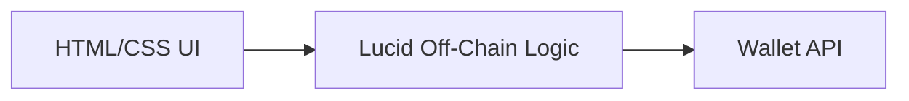
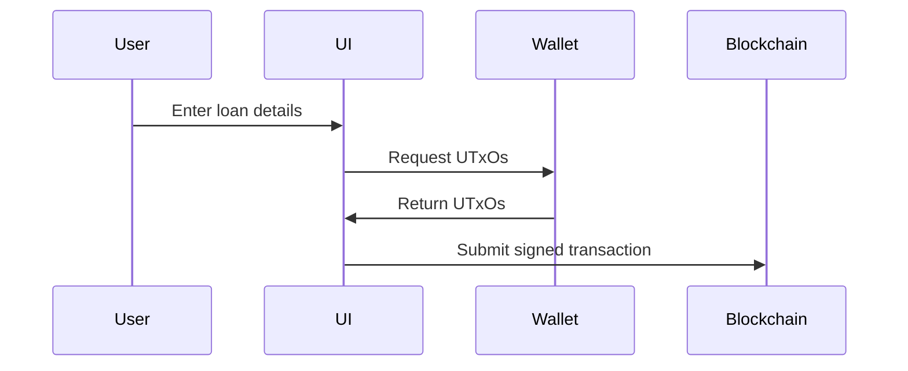
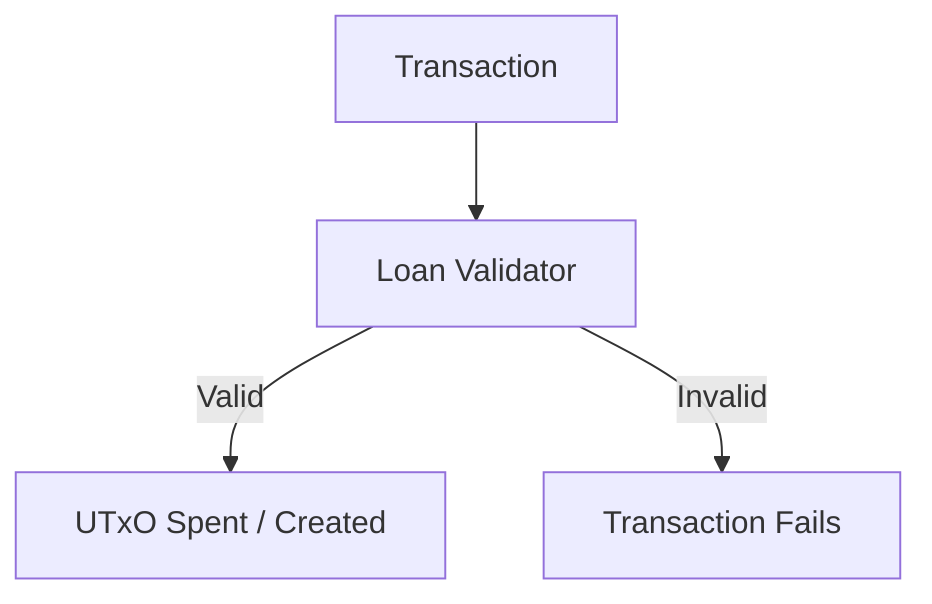
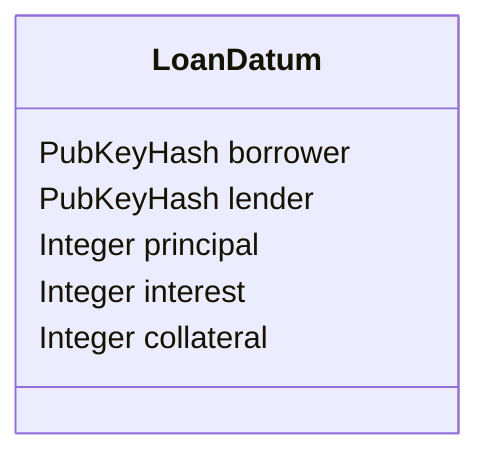
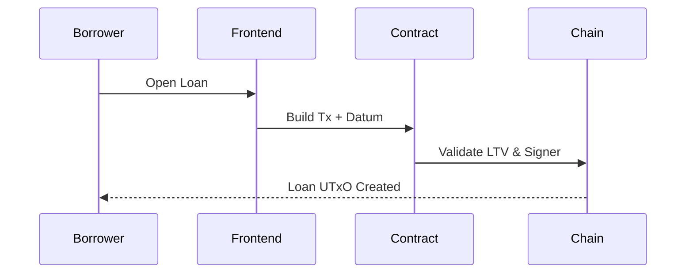
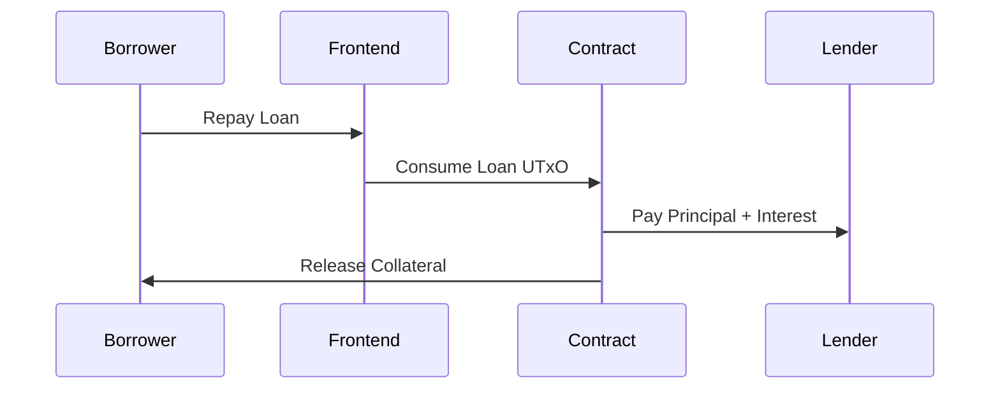
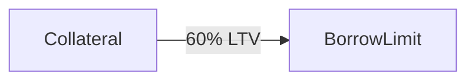
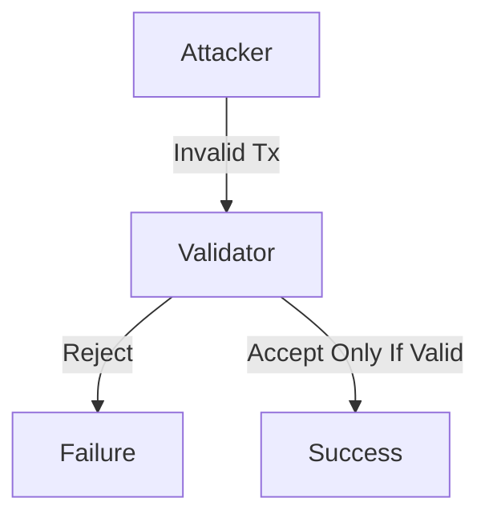
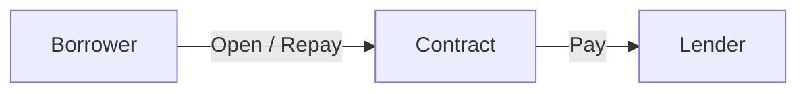
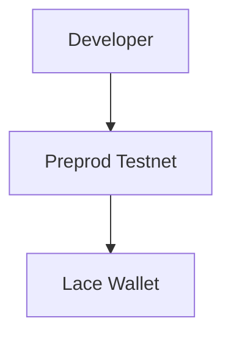

# 📘 P2P Lending dApp

## User Guide & Architectural Documentation

---

## 1. Introduction

The **P2P Lending dApp** is a decentralized finance (DeFi) application built on the **Cardano blockchain** using **Plutus V2 smart contracts** and a **Lucid-based JavaScript frontend**.

The application enables borrowers to obtain loans by **locking ADA as collateral**, with all loan rules enforced on-chain.
The protocol operates **without minting tokens or NFTs**, relying solely on ADA and Cardano’s **extended UTxO (eUTxO) model**.

---

## 2. System Architecture Overview

The system follows a **three-layer architecture**: Frontend, Smart Contract, and Blockchain.

```mermaid
graph TD
    A[User Wallet<br/>(Lace)] -->|Sign Tx| B[Frontend UI<br/>HTML / JS / Lucid]
    B -->|Submit Tx| C[Plutus V2 Validator]
    C -->|Validate & Lock UTxO| D[Cardano Blockchain<br/>(eUTxO Model)]
```

### Architectural Principles

* Non-custodial design
* Deterministic execution
* On-chain enforcement
* Stateless smart contracts

---

## 3. Component Architecture

### 3.1 Frontend Layer



**Responsibilities**

* Wallet connection
* User input handling
* Transaction construction
* Datum encoding/decoding
* Logging and UI feedback

**Important Note**
The frontend is **not trusted**. Any incorrect transaction will fail during on-chain validation.

---

### 3.2 Off-Chain Transaction Logic (Lucid)



**Key Characteristics**

* Builds transactions only
* Does not enforce rules
* Fully wallet-approved
* Stateless and replaceable

---

### 3.3 On-Chain Smart Contract (Plutus V2)



**Responsibilities**

* Enforce loan constraints
* Validate repayment conditions
* Protect collateral
* Ensure correct payouts

---

## 4. Data Architecture (Loan Datum)

Each loan exists as **a single UTxO** at the script address, carrying an **inline datum**.



### Key Properties

* Immutable
* Fully self-describing
* Deterministic state
* No hidden variables

---

## 5. Loan Lifecycle Architecture

### 5.1 Loan Creation Flow



**On-Chain Guarantees**

* Borrower signature required
* Collateral correctly locked
* LTV constraint enforced

---

### 5.2 Loan Repayment Flow



**On-Chain Guarantees**

* Full repayment required
* Correct lender paid
* Collateral released atomically

---

## 6. Loan-to-Value (LTV) Design



### Fixed Protocol Parameter

* **LTV is hard-coded at 60%**
* Displayed in frontend
* Not user-editable
* Enforced in validator

**Why Fixed LTV?**

* Prevents manipulation
* Simplifies auditability
* Guarantees protocol consistency

---

## 7. Security Architecture



### Security Guarantees

| Threat                | Mitigation            |
| --------------------- | --------------------- |
| Fake lender address   | Datum verification    |
| Partial repayment     | Exact value checks    |
| Frontend manipulation | On-chain validation   |
| Unauthorized spending | Signature enforcement |

---

## 8. User Role Architecture



| Role     | Permissions          |
| -------- | -------------------- |
| Borrower | Open and repay loans |
| Lender   | Receive repayment    |
| Frontend | Build transactions   |
| Contract | Enforce all rules    |

---

## 9. Network & Deployment Architecture



* Network: Cardano Preprod
* Era: Babbage
* Script Version: Plutus V2

---

## 10. Design Constraints & Tradeoffs

* No liquidation logic
* Manual lender funding
* One loan per UTxO
* Educational & prototype focus

These decisions prioritize:

* Transparency
* Determinism
* Ease of reasoning
* Protocol correctness

---

## 11. Markdown & PDF Compatibility

### GitHub

* Mermaid supported natively
* Fully rendered diagrams

### PDF Export

Compatible with:

```bash
pandoc user-guide.md -o user-guide.pdf
```

---

## 12. Conclusion

This project demonstrates a **clean, minimal, and secure lending protocol** built on Cardano using:

* ADA-only design
* Plutus V2 validation
* eUTxO-based state
* Deterministic financial logic

It provides a strong foundation for:

* Advanced DeFi systems
* Academic research
* Production-grade lending protocols

---


