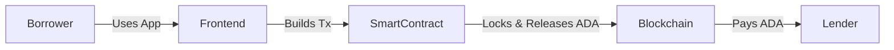
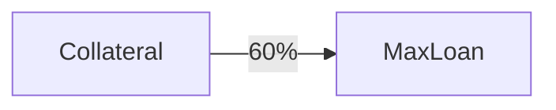
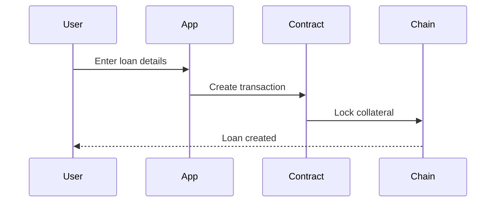
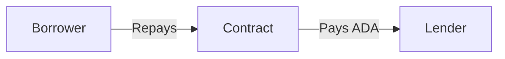
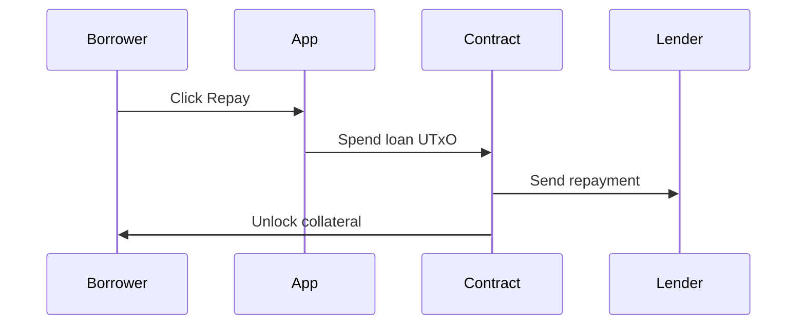
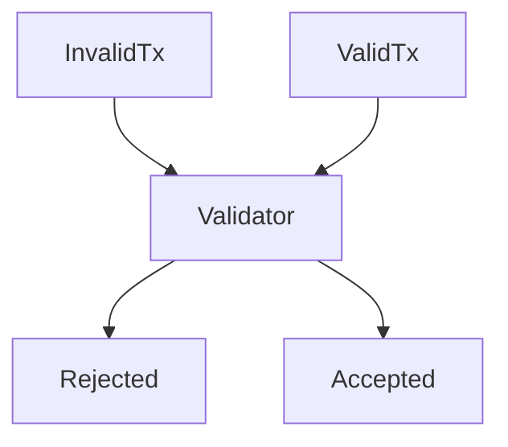
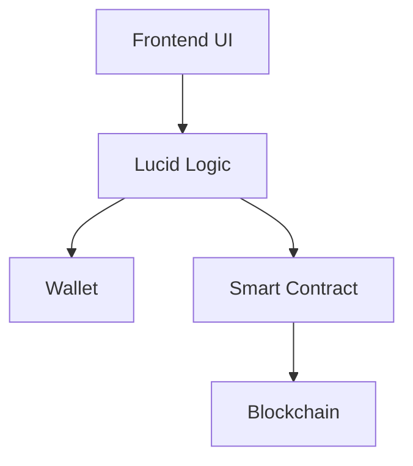

# 📘 P2P Lending dApp

## User Guide & System Overview

---

## 1. What Is This App?

The **P2P Lending dApp** allows users to take loans using **ADA as collateral**, without banks, tokens, or intermediaries.

* Borrowers lock ADA as collateral
* Loans are given based on a **fixed 60% Loan-to-Value (LTV)**
* Borrowers repay the loan plus interest
* Once repaid, collateral is released automatically

Everything is enforced by a **Cardano smart contract**.

---

## 2. Who Is This App For?

This app supports **two roles**:

| Role         | What they do                              |
| ------------ | ----------------------------------------- |
| **Borrower** | Locks collateral and repays the loan      |
| **Lender**   | Receives repayment (principal + interest) |

> ℹ️ The lender does **not** interact with the app directly.
> Only the **borrower connects a wallet**.

---

## 3. High-Level How the App Works



* The **frontend** builds transactions
* The **smart contract** enforces rules
* The **blockchain** stores funds securely

---

## 4. What You Need Before Starting

### Requirements

* Lace wallet installed
* Some ADA for collateral
* Cardano **Preprod** network selected
* Lender’s **Bech32 address**

---

## 5. Connecting Your Wallet

### Step 1: Open the App

Open the app in your browser.

### Step 2: Click **Connect Wallet**

* Choose **Lace**
* Approve the connection

✅ Once connected, your wallet address will be displayed.

---

## 6. Understanding the Loan Parameters

| Parameter          | Description                     |
| ------------------ | ------------------------------- |
| **Collateral ADA** | Amount you lock in the contract |
| **Loan Amount**    | ADA you want to borrow          |
| **Interest**       | Fixed ADA fee                   |
| **LTV**            | Fixed at **60%** (not editable) |



> ℹ️ You cannot borrow more than **60%** of your collateral.

---

## 7. Opening a Loan (Borrower)

### Step-by-Step



### Steps in the App

1. Enter **Collateral ADA**
2. Enter **Loan Amount**
3. Enter **Interest**
4. Paste **Lender Bech32 Address**
5. Click **Open Loan**
6. Approve the transaction in your wallet

✅ Your collateral is now locked in the smart contract.

---

## 8. Where Is the Lender in All This?

* The **lender’s address is provided by the borrower**
* It is stored inside the **loan datum**
* On repayment, the contract **automatically pays the lender**



> ⚠️ The lender address cannot be changed after the loan is opened.

---

## 9. Repaying a Loan

### Step-by-Step



### Steps in the App

1. Click **Repay Loan**
2. Confirm repayment amount
3. Approve transaction in wallet

✅ The lender is paid
✅ Your collateral is released
✅ The loan is closed

---

## 10. Important Rules (Enforced On-Chain)

The smart contract guarantees:

* ❌ You **cannot** unlock collateral without full repayment
* ❌ You **cannot** under-collateralize a loan
* ❌ You **cannot** change the lender address
* ❌ Partial repayment is not allowed



---

## 11. What the App Does NOT Do

* ❌ No liquidation logic
* ❌ No price oracles
* ❌ No token minting
* ❌ No automatic lender funding

This keeps the protocol:

* Simple
* Transparent
* Easy to audit
* Easy to understand

---

## 12. Architecture (Simple Explanation)

### Components



| Component  | Purpose              |
| ---------- | -------------------- |
| Frontend   | User interaction     |
| Lucid      | Transaction building |
| Wallet     | Signing              |
| Contract   | Rule enforcement     |
| Blockchain | Secure storage       |

---

## 13. Logs & Transaction Feedback

* Logs appear at the bottom of the app
* Scrollable container
* Shows transaction hashes and errors

> ℹ️ Errors usually mean **on-chain validation failed**

---

## 14. Network Information

* Network: **Cardano Preprod**
* Script Type: **Plutus V2**
* Address Type: **Shelley (Bech32)**

---

## 15. Frequently Asked Questions

### ❓ Why is LTV fixed?

To prevent manipulation and simplify security.

### ❓ Why does the lender not connect?

The lender only receives ADA — no interaction required.

### ❓ Is my collateral safe?

Yes. Only **your signature + full repayment** can unlock it.

---

## 16. Conclusion

This app provides a **simple, secure, and transparent lending experience** using only ADA and Cardano smart contracts.

It demonstrates:

* Non-custodial design
* Strong on-chain guarantees
* Clear financial logic
* User-controlled funds

---

## 📄 PDF Export

This document can be converted to PDF:

```bash
pandoc USER_GUIDE.md -o USER_GUIDE.pdf
```

---

